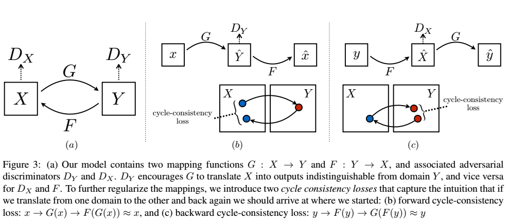
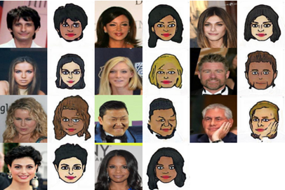
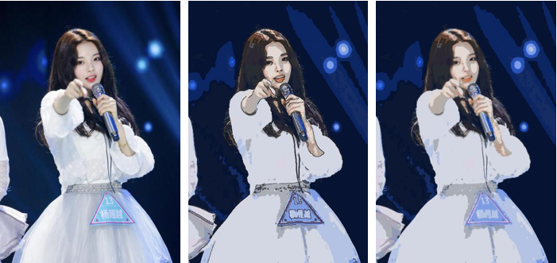

# Cartoonization-of-human-face
本项目将人脸照片转换为卡通头像：使用到 **CycleGAN** 和 **G-means** 两种方法

## CycleGAN
CycleGAN 其实就是一个 A→B 单向 GAN 加上一个 B→A 单向 GAN。两个 GAN 共享两个生成器，然后各自带一个判别器，所以加起来总共有两个判别器和两个生成器。一个单向 GAN 有两个 loss，而 CycleGAN 加起来总共有四个 loss。  

[CycleGAN](https://github.com/junyanz/CycleGAN) 论文的原版原理图和公式如下：

### 数据源
人脸（839张）：celeba数据集  
卡通头像（1000张）：调用 [Bitmoji API](https://github.com/davrempe/domain-transfer-net/blob/master/datasets/bitmoji_api_info.md) 生成

### 模型效果
训练27个epoch后效果如下：  

## K-means
一般的k-means算法需要首先确定聚类簇数k值，这里采用其改进算法G-means自动确定模型k值。将图片转换为HSV颜色空间，包括色调、饱和度、亮度。对于三个空间的每一组数据，先取k=1，通过k-means算法得到中心点，如果此簇数据服从高斯分布，则结束；如果此簇数据不服从高斯分布，用两个中心点替换此中心点，k=k+1，通过k-means算法得到新的k簇数据，看每簇数据是否服从高斯分布，由此进行递归。具体算法如下：  

### 模型效果
本模型**无需训练**，经过参数调整，得到最合适的模型。  
调整的参数主要有判断是否为高斯分布的置信度，数据最小数量等

